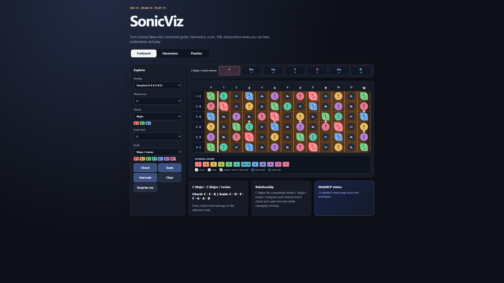
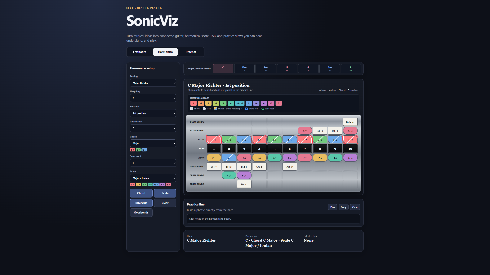
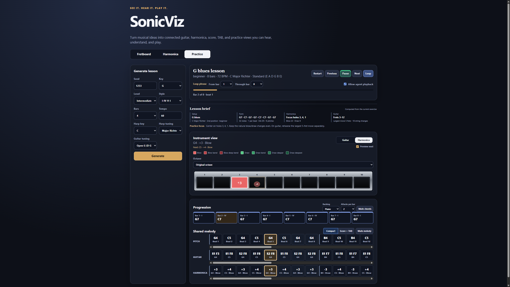
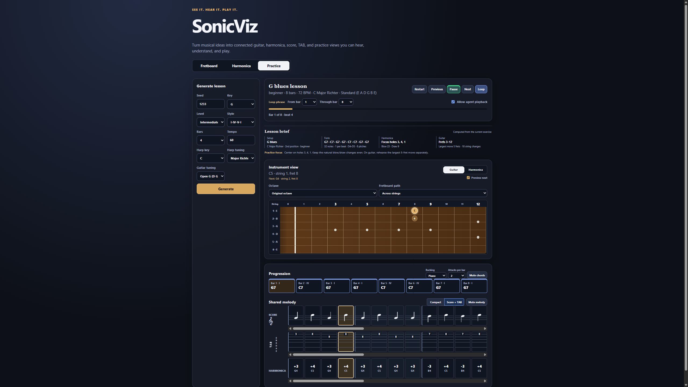
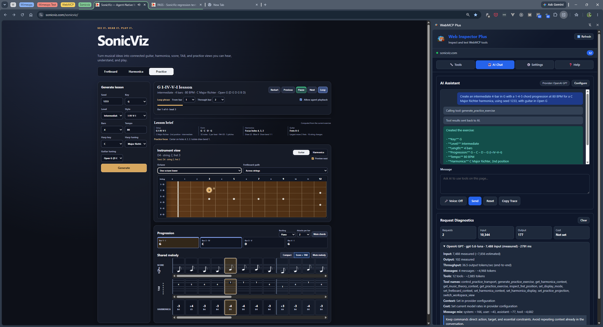
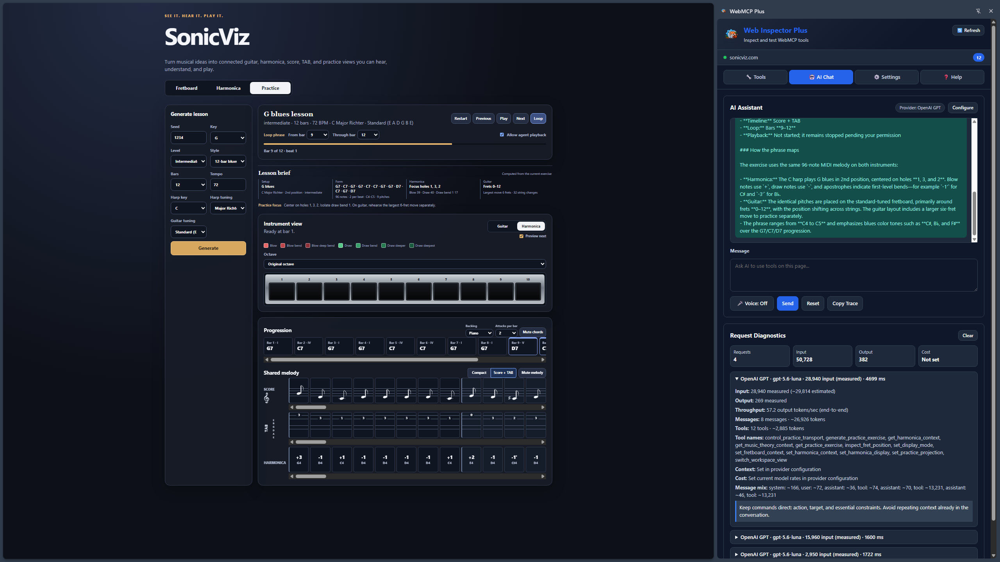

# SonicViz

**See it. Hear it. Play it.**

SonicViz is an agent-native music practice environment that turns musical ideas into connected guitar, harmonica, score, TAB, and practice views. It helps people understand and play music. It does not generate a finished song for them.

Built for [The WebMCP Challenge](https://webmcp.devpost.com/).

## What SonicViz does

SonicViz provides three connected workspaces:

- **Fretboard** explores guitar chords, scales, intervals, tunings, and individual fret positions.
- **Harmonica** explores a 10-hole diatonic harmonica, positions, bends, overbends, theory relationships, and playable tablature.
- **Practice** creates deterministic cross-instrument exercises with a chord progression, canonical timed melody, four technique levels from Beginner through Pro, guitar and harmonica projections, compact or Score + TAB views, expressive sampled Harmonica and Guitar playback with a subtle room effect, sampled upright Piano backing enabled by default with sampled steel-string Guitar as an alternative, bar inspection, loops, and tempo control.

Every core workflow remains available through the visible interface. WebMCP adds a structured agent interface without replacing direct human control.

## Screenshots













## Music-learning notes

SonicViz is built around a few ideas that matter when you learn an instrument:

- **One melody, many routes.** A lesson stores one chord progression and one timed melody. Guitar positions, harmonica holes, score, and TAB are all views of those same notes. You practice the music, and the app keeps showing where it lives under different hands and breath.
- **Positions are the harmonica's key changes.** 1st, 2nd, and 3rd position play the same harp over different keys and modes (Ionian, Mixolydian, Dorian). 2nd position, also called cross harp, is the default blues sound. SonicViz recalculates every hole when you change position.
- **Bends and overbends fill the gaps.** A diatonic harp cannot reach every chromatic note by blowing and drawing alone. Bends, overblows, and overdraws fill the gaps, and different tunings (Major Richter, Country, Paddy Richter) change which gaps exist. The Harmonica and Practice views show the technique each note needs.
- **Intervals label what a note means.** Chord and scale overlays mark each note's interval from its root. Shared notes show both roles at once, at the moment a scale run and a chord voicing overlap.
- **Slow, looped, and muted is how practice compounds.** Loop a few bars, drop the tempo, mute the melody to play against the backing alone, or mute the backing to hear your part clearly. A lesson from the same seed comes back exactly the same, so you can ask whether you improved this week.

## Why WebMCP

**A strong fit for the use case.** A browser agent helping a musician practice would otherwise have to look at a dense fretboard, hole chart, and timeline and guess how to operate them. SonicViz exposes 12 typed, task-level tools through `document.modelContext.registerTool()`. The agent reads and writes exact musical state: tuning, key, scale, chord, loop bounds, octave projection. No guessing at the screen. A request like "loop the turnaround and slow it down" becomes one validated tool call.

**A better experience.** Speak a practice goal hands-free. The agent makes one validated call and the lesson appears locally and deterministically from a seed. Every change stays visible in the interface the person still controls. Playback requires explicit, page-session consent. There is no account, API key, or backend.

**What people and agents can now do together.** One canonical melody can be reprojected across guitar, harmonica, score, and TAB without changing its pitch or timing. That kind of cross-instrument arrangement would take an agent many fragile UI steps, but it is a single `set_practice_projection` call now. The agent prepares the repetition. The person supplies breath, timing, and judgment.

**How SonicViz implements WebMCP.** `webmcp.js` centralizes registration of all 12 tools. Every schema rejects additional properties and constrains supported values and ranges. Read-only tools declare `readOnlyHint`. Tool results share the same state slice as the visible interface, so the person can inspect every change and take over at any moment.

SonicViz does the deterministic music calculations. The external agent interprets the person's intent and orchestrates the right tools.

## Try it

**Live application:** https://sonicviz.github.io/sonicviz-webmcp/

No account, API key, backend, or paid service is required.

For WebMCP agent use, open the deployed application in either:

- ChatGPT's WebMCP-enabled in-app browser; or
- Google Chrome 149+ with `chrome://flags/#enable-webmcp-testing` enabled.

In an ordinary browser, the complete direct interface still works; only agent tool discovery is unavailable.

## Example agent request

After opening SonicViz, ask the browser agent:

> Open Practice and create an intermediate 4-bar in G with a 1-4-5 chord progression at 80 BPM for a C Major Richter harmonica, using seed 1233, with guitar in Open G. Show Score + TAB, loop bars 1 through 2, and explain how the same phrase maps to harmonica and guitar. Do not start playback until I allow it.

The agent should navigate explicitly, generate one deterministic lesson, update the visible controls and tracks, and report the resulting musical state.

## Try these agent commands

Paste any of these into a WebMCP-capable browser agent. Each uses one or two typed tools and leaves the visible app in the matching state, so you can see the agent and the interface agree. The first three Practice rows demonstrate determinism: the same seed reproduces the same lesson, while a different seed keeps the form and changes the melody.

| Workspace | Command | What it shows |
| --- | --- | --- |
| Fretboard | "Show the chord on the fretboard." | Only chord tones light up. |
| Fretboard | "Show both chord and scale with interval labels on." | Which scale notes are also chord tones, plus each note's interval. |
| Fretboard | "Set chord root D, scale root C, chord Minor, scale Major." | D minor over C major. Watch the shared D and F notes. |
| Fretboard | "Set tuning to Open G and inspect string 6 fret 0." | Retuning changes where the same low D lives. |
| Harmonica | "Set the harmonica position to 2nd position." | Cross harp: roots move and the scale becomes Mixolydian. |
| Harmonica | "Set the harmonica tuning to Country." | Hole 5 draw becomes F♯, with its draw bend F. |
| Harmonica | "Set a D Country-tuned harmonica in 2nd position and show C major over A Mixolydian with intervals and overbends." | Position, mode, and the full overbend row in one shot. |
| Harmonica | "Read the current harmonica context without changing it." | A read-only tool reports the exact setup and phrase. |
| Practice | "Create an intermediate four-bar G lesson with a 1-4-5 progression at 80 BPM for a C Major Richter harmonica, using seed 1233, with guitar in Open G." | The video's lesson. The same seed always produces the same melody. |
| Practice | "Repeat that exact request." | Identical lesson: same progression, notes, positions, and tab. |
| Practice | "Generate the same lesson with seed 1234." | Same form and progression, a different (equally playable) melody. |
| Practice | "Show Score + TAB." | Staff, guitar TAB, and harmonica tab appear together. |
| Practice | "Loop bars 9 through 12 at 60 BPM and play." | A slow four-bar loop with count-in (after you allow playback). |
| Practice | "Show the same lesson on guitar one octave lower, along the strings, with preview off." | The notes do not change; the guitar route does. |
| Practice | "Mute the melody, then play." | Practice your part against the backing alone. |
| Navigation | "Switch to practice and generate an intermediate twelve-bar G blues at 72 BPM for a C Major Richter harmonica with seed 1234, show it on guitar one octave lower along strings in Score + TAB with preview off, loop bars 9 through 12 at 60 BPM, and play." | The full one-shot workflow in a single sentence. |
| Robustness | "Set the chord root to H." | Schema validation rejects it; the board stays unchanged. |

## WebMCP tools

SonicViz registers 12 tools from one centralized owner in `webmcp.js`.

| Workspace | Tool | Purpose |
| --- | --- | --- |
| Fretboard | `set_fretboard_context` | Configure independent guitar tuning, chord, scale, and roots. |
| Fretboard | `get_music_theory_context` | Read the selected chord, scale, tones, and overlap. |
| Fretboard | `set_display_mode` | Show chord tones, scale tones, both, neither, and interval labels. |
| Fretboard | `inspect_fret_position` | Explain one guitar position and its theory membership. |
| Harmonica | `set_harmonica_context` | Configure harmonica tuning, key, position, chord, and scale. |
| Harmonica | `get_harmonica_context` | Read setup, technique layout, theory state, and current phrase. |
| Harmonica | `set_harmonica_display` | Control chord, scale, interval, and overbend visibility. |
| Practice | `generate_practice_exercise` | Create a deterministic guitar-and-harmonica lesson. |
| Practice | `get_practice_exercise` | Read canonical events, derived views, lesson briefing, and transport. |
| Practice | `set_practice_projection` | Change playable instrument projections and timeline presentation. |
| Practice | `control_practice_transport` | Control playback, looping, tempo, navigation, backing, and melody mute. |
| Workspace | `switch_workspace_view` | Change tabs only after an explicit navigation request. |

Read-only tools declare `readOnlyHint`. Every schema rejects additional properties and constrains supported values and ranges.

Only `switch_workspace_view` changes the active tab. Domain tools preserve the current workspace, and standalone Fretboard, standalone Harmonica, and Practice keep independent state.

## Run locally

SonicViz is a dependency-free static application. It has no package installation or build step.

Requirements:

- A modern browser
- Python 3, or another static HTTP server
- Chrome 149+ only when testing WebMCP in Chrome

From the repository root:

```powershell
python -m http.server 4173 --bind 127.0.0.1
```

Open:

```text
http://127.0.0.1:4173/
```

Opening `index.html` directly may render the interface, but a local HTTP server is the supported path because browser local-file policies vary.

## Testing

### Automated browser regression

With the local server running, open:

```text
http://127.0.0.1:4173/tests/regression.html
```

A successful run changes the page title to `PASS - SonicViz regression tests` and reports:

```text
26 of 26 tests passed
```

The suite loads the production application in a same-origin iframe and exercises deterministic generation, canonical-event integrity, projections, score and TAB, linked bar inspection, independent workspace state, all 12 WebMCP descriptors, transport, backing and melody mute, local sample decoding and lazy Guitar loading, expressive scheduling, and explicit agent-playback consent.

### JavaScript syntax

With Node.js installed, PowerShell users can check every JavaScript file independently:

```powershell
$failed = $false
Get-ChildItem -Recurse -Filter *.js | ForEach-Object {
  node --check $_.FullName
  if ($LASTEXITCODE -ne 0) { $failed = $true }
}
if ($failed) { exit 1 }
```

### Deployment acceptance

- [ ] Direct interface works at the public HTTPS URL without credentials.
- [ ] ChatGPT's in-app browser discovers exactly 12 tools and completes the example request.
- [ ] Chrome 149+ with WebMCP enabled discovers exactly 12 tools and completes the example request.
- [ ] The deployed regression page reports 26/26 tests passed.
- [ ] Playback remains blocked until a direct gesture or explicit page-session consent.
- [ ] Browser console has no application errors.
- [ ] Desktop and mobile layouts have been visually checked.

## Architecture

SonicViz uses plain HTML, CSS, and JavaScript:

| File | Responsibility |
| --- | --- |
| `index.html` | Semantic application shell and visible controls. |
| `styles.css` | Responsive visual system and instrument layouts. |
| `theory.js` | Notes, scales, chords, intervals, tunings, and shared transformations. |
| `session.js` | In-memory state slices, bounded change history, and subscriptions. |
| `audio.js` | Shared Web Audio context, instrument voices, expression, and scheduling. |
| `assets/` | Repository-local media assets and their provenance/license notices. |
| `fretboard.js` | Guitar state, rendering, interaction, and tool descriptors. |
| `harmonica.js` | Harmonica state, rendering, interaction, and tool descriptors. |
| `practice.js` | Exercise generation, projections, notation, playback, and practice tools. |
| `workspace.js` | Tab registry, navigation state, and the navigation tool. |
| `webmcp.js` | Centralized WebMCP registration and readiness reporting. |
| `tests/` | Dependency-free browser regression harness. |

Practice stores one canonical progression and monophonic timed MIDI melody. Guitar positions, harmonica tablature, score, TAB, lesson briefing, highlighting, and playback are deterministic projections of those events rather than independent copies.

## Trust and scope

- The application has no embedded chatbot and calls no model API. AI enters through an external WebMCP-capable browser agent.
- Musical results are calculated locally from explicit rules and validated state, not invented by a language model.
- State is kept in the current page session. There is no account, cloud sync, analytics, or backend.
- Audio uses the browser's Web Audio API. Agent-requested playback requires explicit, revocable permission for the current page session.
- SonicViz does not record microphone input or assess a person's performance.
- The submitted application contains no third-party runtime dependencies or external runtime services.

## Third-party assets

The Piano backing sound uses a 12-file, range-limited subset of the FreePats
**Upright Piano KW (small)** sound bank. The recordings were made by Gonzalo and
Roberto and published under the
[CC0 1.0 Universal public-domain dedication](https://creativecommons.org/publicdomain/zero/1.0/),
which permits copying, modification, redistribution, public performance, and
commercial use without an attribution requirement. SonicViz retains a provenance
notice in [`assets/piano/upright-kw/`](assets/piano/upright-kw/README.md).

The 12-file Piano set totals 1,405,512 bytes and is prepared when Piano backing
is requested. All samples are served from this repository. No WebAudioFont,
Tone.js, sampler package, CDN, remote API, or external audio host is used at
runtime.

Guitar playback uses an eight-file, range-limited subset of the FreePats **FSS
Steel-String Acoustic Guitar** sound bank, assembled from Gary Campion's FS
Seagull recordings. The files remain under GPL version 3 or later with the
FreePats sound-sample exception. SonicViz losslessly converted selected WAV
anchors to FLAC and capped unusually long tails at 6.2 seconds. The 885,637-byte
set is fetched and decoded only after Guitar audio is requested, so it adds no
sample transfer or decoded-buffer memory to the initial page load. Full
provenance, conversion details, license text, and exception wording are retained
in [`assets/guitar/fss-steel-string/`](assets/guitar/fss-steel-string/README.md).

The previous Karplus-Strong-style physical-string implementation remains in
`audio.js` as `playSynthGuitar`. It is the automatic load-failure fallback and
the documented rollback route if sampled playback proves unsuitable: route
`playGuitar` directly to `playSynthGuitar` and remove Guitar preparation without
changing any melody, chord, transport, or WebMCP caller.

Harmonica playback uses nine normal-sustain anchors from the Versilian Community
Sample Library C diatonic harmonica. VCSL is published under CC0 1.0. SonicViz
trimmed and resampled the selected mono anchors to 32 kHz FLAC; the 993,514-byte
set covers MIDI 60-96 with at most four semitones of pitch shifting. It is
fetched and decoded only after Harmonica audio is requested. The previous
filtered reed renderer remains as `playSynthHarmonica`: it handles immediate
audition while the bank first loads, load/decode failure, and notes outside the
sampled range. Provenance and conversion details are retained in
[`assets/harmonica/vcsl-special20-c/`](assets/harmonica/vcsl-special20-c/README.md).

Realistic instrument timbre is part of the learning experience rather than
decorative polish. A credible attack, body, and decay give the learner a more
musical pitch and phrasing reference than recognizably synthetic MIDI-like
playback while canonical notes and timing remain deterministic.

## Challenge provenance

SonicViz was built from scratch during The WebMCP Challenge submission period, starting on August 28, 2026. Development was done in tandem with AI assistants, primarily GPT-5.6 Sol plus a few other models, with the creator making the musical, product, and judging decisions. It is informed by the creator's prior music-performance, visualization, and learning-tool experience, but it does not include proprietary HarpNinja source code or specialist datasets.

The public repository contains the complete source, assets, license, and instructions required to run and test the submitted application. Testing was extensive: a 26-check browser regression suite and a long manual QA checklist, both described in the build blog post at https://sonicviz.com/2026/09/03/webmcp-deterministic-hybrid-app-design/.

## Demo video

**Public video:** https://www.youtube.com/watch?v=G5sMdtVDlYs

The challenge video must be public, include audio, clearly demonstrate the working application and its WebMCP integration, and remain under three minutes. It must not contain unlicensed music, footage, or third-party trademarks.

## License

SonicViz code is free software licensed under the [GNU Affero General Public License v3.0 only](LICENSE), identified by SPDX as `AGPL-3.0-only`. The bundled Upright Piano KW and VCSL harmonica recordings remain available under CC0 1.0. The bundled FSS Steel-String Acoustic Guitar recordings remain under GPL version 3 or later with the FreePats sound-sample exception, as documented above.

Distributed derivatives must remain under the same license. Modified versions used over a network must offer their complete corresponding source to users as required by the license.

Copyright (C) 2026 Paul Cohen.
